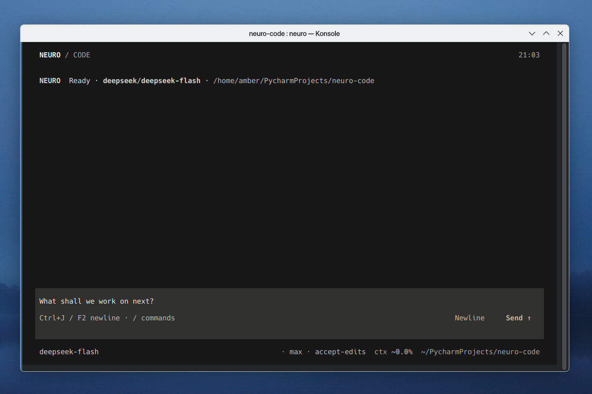

# Neuro Code

[English](README.md) · [简体中文](docs/zh-CN/README.md)

[](https://github.com/hvqo/neuro-code/actions/workflows/ci.yml)
[](pyproject.toml)
[](LICENSE)
[](#project-status)

Neuro Code is a Python-native coding agent for the terminal. It helps developers inspect, edit, and test a codebase through a model-driven workflow while keeping local actions inside explicit workspace, permission, and sandbox boundaries.

Named provider profiles and durable sessions make the workflow adaptable across supported model services without tying the runtime to a single hosted provider.

<p align="center">
  
</p>

## Why Neuro Code?

- **Agentic coding workflow** — Move from a prompt to repository inspection, bounded file edits, command execution, and iterative results in one agent loop.
- **Provider flexibility** — Connect named profiles to supported model services and switch the active profile per run or from the TUI.
- **Explicit control** — Side-effecting tools pass through permission policy and workspace checks; optional OS-level child sandboxes constrain approved local work.
- **Durable sessions** — Continue, search, rename, fork, export, and import conversations backed by SQLite, with workspace, provider, and sandbox checks on resume.

## Quick Start

Neuro Code is pre-alpha and is currently run from a source checkout. Python 3.12 or newer is required; this setup uses [`uv`](https://docs.astral.sh/uv/).

```bash
git clone https://github.com/hvqo/neuro-code.git
cd neuro-code
uv sync --extra dev
uv run neuro
```

The first interactive launch opens provider setup when no ready profile is configured. The current directory becomes the workspace. After configuring a provider profile, run a headless prompt with:

```bash
uv run neuro-code -p "Explain this repository"
```

## Core capabilities

- **Coding workflow** — Headless prompts and the Textual TUI share one event-driven runtime. Built-in tools cover bounded file inspection and search, exact replacement edits, Bash, background tasks, and plans.
- **Model providers** — Named profiles use OpenAI Responses, OpenAI-compatible Chat, Anthropic Messages, or Gemini adapters, with provider- and model-specific capability checks.
- **Tools** — Repository and shell tools are built in; optional web search, public web fetch, and read-only LSP integrations are available for supported configurations.
- **Sessions** — SQLite-backed sessions support resume, workspace-scoped search, titles, fork, export/import, and durable plan/task metadata.
- **TUI** — A Textual interface provides streaming conversation, provider and session selectors, approval prompts, slash commands, Markdown rendering, and persisted UI preferences.

For a local `0.1.0a1` wheel/sdist build and clean-install check, follow the
[preview release candidate procedure](docs/en/release-candidate.md). No public
package has been published yet.

## Safety & Control

- **Workspace boundary** — Structured filesystem operations resolve targets inside the launch workspace and any explicitly configured roots; link-like escapes are rejected.
- **Permission boundary** — Deny/ask/allow rules gate side-effecting tools. Explicit deny remains authoritative, and unresolved approval requests are denied in headless mode.
- **Sandbox boundary** — `off`, `workspace`, `read-only`, and `strict` profiles are available. The default `off` profile intentionally provides no OS isolation; enabled profiles use platform-specific child boundaries when enforceable, and unsupported explicit requests fail closed.

Permissions, workspace identity, and sandbox policy remain separate decisions. See the [architecture](docs/en/architecture.md) and [compatibility matrix](docs/en/compatibility-matrix.md) for the current boundary.

## Integrations

- **Provider integrations** — The current service catalog includes OpenAI, xAI, Anthropic, Gemini, DeepSeek, Kimi, GLM, MiniMax, Volcengine Ark, Baidu Qianfan, Alibaba Model Studio, Tencent TokenHub, and generic OpenAI-compatible endpoints. Actual capability is provider- and model-specific; consult the [compatibility matrix](docs/en/compatibility-matrix.md).
- **MCP** — Session-owned MCP server connections support stdio, Streamable HTTP, and legacy SSE transports with bounded tool discovery and execution.
- **ACP** — A partial ACP v1 adapter is available over newline-delimited stdio, with a bounded WebSocket bridge and selected workspace-bound session, permission, filesystem, and terminal capabilities. ACP compatibility is intentionally partial; see the [compatibility matrix](docs/en/compatibility-matrix.md).

## Project status

Neuro Code is **pre-alpha**. The current source tree includes implemented slices for the CLI and headless runtime, Textual TUI, named provider profiles, local tools, SQLite sessions, permission and sandbox controls, MCP connections, and partial ACP.

Provider/model compatibility, platform sandbox coverage, and protocol surface are still evolving. Check the [compatibility matrix](docs/en/compatibility-matrix.md) for current support boundaries and the [development plan](docs/en/rewrite-plan.md) for the roadmap.

## Documentation

| Topic | English | 简体中文 |
|---|---|---|
| Product guide | [docs/en/README.md](docs/en/README.md) | [docs/zh-CN/README.md](docs/zh-CN/README.md) |
| Architecture | [Architecture](docs/en/architecture.md) | [架构](docs/zh-CN/architecture.md) |
| Compatibility | [Compatibility matrix](docs/en/compatibility-matrix.md) | [兼容性矩阵](docs/zh-CN/compatibility-matrix.md) |
| Roadmap | [Development plan](docs/en/rewrite-plan.md) | [开发计划](docs/zh-CN/rewrite-plan.md) |
| Contributing | [Contributing](docs/en/CONTRIBUTING.md) | [贡献指南](docs/zh-CN/CONTRIBUTING.md) |
| Architecture decisions | [ADRs](docs/en/adr/) | [ADR](docs/zh-CN/adr/) |
| Preview candidate | [Release candidate](docs/en/release-candidate.md) | [预览候选](docs/zh-CN/release-candidate.md) |

## Contributing

See the [contributing guide](docs/en/CONTRIBUTING.md) for the development workflow, required checks, and documentation rules.

## License

Licensed under the [Apache-2.0 License](LICENSE).
